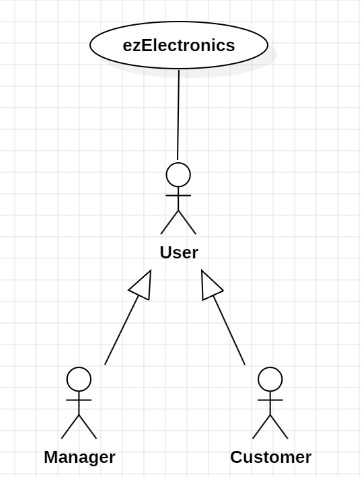
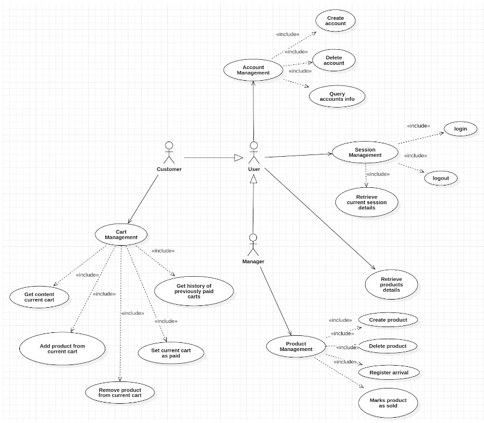
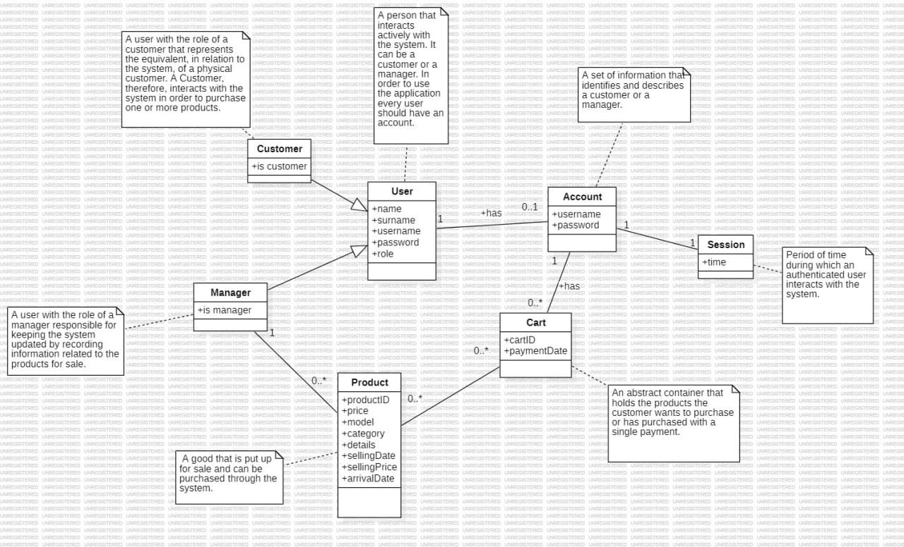

# Requirements Document - current EZElectronics

Date:

Version: V1 - description of EZElectronics in CURRENT form (as received by teachers)

| Version number | Change |
| :------------: | :-----:|
|       1.0      |        |

# Contents

- [Requirements Document - current EZElectronics](#requirements-document---current-ezelectronics)
- [Contents](#contents)
- [Informal description](#informal-description)
- [Stakeholders](#stakeholders)
- [Context Diagram and interfaces](#context-diagram-and-interfaces)
  - [Context Diagram](#context-diagram)
  - [Interfaces](#interfaces)
- [Stories and personas](#stories-and-personas)
- [Functional and non functional requirements](#functional-and-non-functional-requirements)
  - [Functional Requirements](#functional-requirements)
  - [Non Functional Requirements](#non-functional-requirements)
- [Use case diagram and use cases](#use-case-diagram-and-use-cases)
  - [Use case diagram](#use-case-diagram)
    - [Use case 1, UC1](#use-case-1-uc1)
      - [Scenario 1.1](#scenario-11)
      - [Scenario 1.2](#scenario-12)
      - [Scenario 1.x](#scenario-1x)
    - [Use case 2, UC2](#use-case-2-uc2)
    - [Use case x, UCx](#use-case-x-ucx)
- [Glossary](#glossary)
- [System Design](#system-design)
- [Deployment Diagram](#deployment-diagram)

# Informal description

EZElectronics (read EaSy Electronics) is a software application designed to help managers of electronics stores to manage their products and offer them to customers through a dedicated website. Managers can assess the available products, record new ones, and confirm purchases. Customers can see available products, add them to a cart and see the history of their past purchases.

# Stakeholders

| Stakeholder name          | Description                                       |
| :-----------------------: | :-----------------------------------------------: |
| User                      | The customer                                      |
| Manager                   | Who use the website                               |
| Developer                 | Person who develops and maintains the application |
| Google play + apple store | The service that permit to download the app       |

# Context Diagram and interfaces

## Context Diagram

## Interfaces

|   Actor   | Logical Interface           | Physical Interface |
| :-------: | :-------------------------: | :----------------: |
| Customer  | GUI (Website / Application) | Smartphone / PC    |
| Manager   | GUI (Website / Application) | PC                 |

# Stories and personas

## Person 1 
Benedetto, male, 46 years old, Manager of one electronic store. He wants to sell the products to customers through a website and manage the sales of the products.

## Person 2   
Federica, female, 27 years old, architect, Customer. She needs a new smartphone. Wants to see the information about the last smartphone that she bought from the website and according to that information she wants to see the available smartphones on the website and decide which one to cart.

## Person 3 
Stefano, male, 19 years old, engineering student, Customer. He needs a laptop to use in university. He wants to cart the most suitable laptop from the available laptops.

## Story 1
Persona 1 is the manager of “Techstore” electronic store. He wants to sell the products of the store on a website. He is a new user of the website and signed in the website as a manager. He posts the information about the products on the website and he can manage the sales from the website.

## Story 2
Persona 2 bought a smartphone from the website 3 years ago. Her smart phone is not working properly. She wants to buy a new one. However, she thinks that she needs a better smartphone which has a better camera for the photographs of the buildings she is designing and more storage for the project files and photographs of the buildings she is working on. She is an old customer of the website and after she entered her username and password, she got access to the available products.  She learns the details about her phone from the history of her purchases. She searches for the available smartphones on the website and carts the one which satisfies her needs from the available smartphones.

## Story 3
Persona 3 is an electronics engineering student  in university. He needs to download such tools for his homeworks and projects. He needs a laptop convenient for him but he is a new customer and he doesn’t have an account.  He creates a new account as a customer with a username and password. He searches for laptops on the website. He compares the details about the laptops. He carts the one which is suitable for him. 

## Story 4
Persona 1 sold all products that were previously created by him. He deletes this product because there is no product left in stock.

# Functional and non functional requirements

## Functional Requirements

|  ID   | Description |
| :---: | :---------: |
|  FR1  | Authorization and Authentication |
|  FR1.1  | Account Management |
|  FR1.1.1  | Create/Delete Account (Customer/Manager) |
|  FR1.1.2  | Query informations about one or more accounts |
|  FR1.2  | Session Management |
|  FR1.2.1  | Login/Logout |
|  FR1.2.2  | Retrieve current session details |
|  FR2  | Products Management |
|  FR2.1  | Create/Delete Product |
|  FR2.2  | Update information of a product (Mark as sold) |
|  FR2.3  | Register arrival of a set of products |
|  FR2.4  | Query informations about one or more products |
|  FR3  | Carts management for a logged customer |
|  FR3.1  | Create a cart |
|  FR3.2  | Get content of the current cart |
|  FR3.3  | Add/Remove a product from the current cart |
|  FR3.4  | Set current cart as paid |
|  FR3.5  | Get history of previously paid carts |
|  FR4  | Privacy Management |
|  FR4.1  | Show legal constraints |

## Non Functional Requirements

|   ID    | Type (efficiency, reliability, ..) | Description | Refers to |
| :-----: | :--------------------------------: | :---------: | :-------: |
|  NFR1   | Usability | User should be able to use mobile app with no training in less than 2 minutes (marketing reasons) | All FR |
|  NFR2   | Usability | Manager should be able to use the website with training in less than 30 minutes | All FR |
|  NFR3   | Efficiency | All functions on the mobile app must be completed in <0.1 sec (excluding network latency) | All FR |
|  NFR4   | Efficiency | The app should require < 100Mb disk space for user | All FR |
|  NFR5   | Reliability | No more than three defect per year per user | All FR |
|  NFR6   | Portability | The app should be available IOS from release 15 and Android from release 9 |  |
|  NFR7   | Security | The app and the website should work with password to prevent account theft | FR1.3 |

# Use case diagram and use cases

## Use case diagram

### Use case 1, Login

| Actors Involved  | User |
| :--------------: | :------------------------------------------------------------------: |
|   Precondition   | User not logged in, user registered |
|  Post condition  | User logged in |
| Nominal Scenario | 1-1 |
|     Variants     | sNone |
|    Exceptions    | cenario 1-2, 1-3 |

##### Scenario 1-1

|  Scenario 1-1  | Login |
| :------------: | :------------------------------------------------------------------------: |
|  Precondition  | User not logged in, user registered |
| Post condition | Logged in |
|     Step#      |                                Description                                 |
|       1        | System: Ask username, password |
|       2        | User: Provide username, password |
|       3        | System: Read username, password |
|       4        | System: Retrieve password, compare with the one provided. Passwords match, user is authorised |

##### Scenario 1-2

|  Scenario 1-2  | User not registered |
| :------------: | :------------------------------------------------------------------------: |
|  Precondition  | User not logged in, user not registered |
| Post condition | Not logged in |
|     Step#      |                                Description                                 |
|       1        | System: Ask username, password |
|       2        | User: Provide username, password |
|       3        | System: Read username, password. Check cookie,  the user is not logged in |
|       4        | System: Given username, find the user. User is not found. User not authorised |

##### Scenario 1-3

|  Scenario 1-3  | User already logged in |
| :------------: | :------------------------------------------------------------------------: |
|  Precondition  | User logged in, User registered |
| Post condition | User logged in |
|     Step#      |                                Description                                 |
|       1        | System: Ask username, password |
|       2        | User: Provide username, password |
|       3        | System: Read username, password. Check cookie,  the user is already logged in |
|       4        | System: Return an error message 401 |

### Use case 2, Logout

| Actors Involved  | User |
| :--------------: | :------------------------------------------------------------------: |
|   Precondition   | User logged in |
|  Post condition  | User not logged in |
| Nominal Scenario | 2-1 |
|     Variants     | None |
|    Exceptions    | Scenario 2-2 |

##### Scenario 2-1, Logout

|  Scenario 2-1  | Logout |
| :------------: | :------------------------------------------------------------------------: |
|  Precondition  | User logged in |
| Post condition | User not logged in |
|     Step#      |                                Description                                 |
|       1        | User: Asks to logout |
|       2        | System: Find user, check cookie, the user is logged in |
|       3        | System: Remove authorization to the user device |

##### Scenario 2-2

|  Scenario 2-2  | User already logged out |
| :------------: | :------------------------------------------------------------------------: |
|  Precondition  | User not logged in |
| Post condition | User not logged in |
|     Step#      |                                Description                                 |
|       1        | User: Asks to logout |
|       2        | System: Check that the user isn't already logged out |
|       3        | System: User hasn't performed login yet. Show an error message 401 |

### Use case 3, Retrieve current session details

| Actors Involved  | User |
| :--------------: | :------------------------------------------------------------------: |
|   Precondition   | User logged in |
|  Post condition  | User information shown |
| Nominal Scenario | 3-1 |
|     Variants     | None |
|    Exceptions    | Scenario 3-2 |

##### Scenario 3-1

|  Scenario 3-1  | Retrieve current session details |
| :------------: | :------------------------------------------------------------------------: |
|  Precondition  | User logged in |
| Post condition | User information shown |
|     Step#      |                                Description                                 |
|       1        | User: logged in |
|       2        | System: Show username,name, surname, role of the logged in user |

##### Scenario 3-2

|  Scenario 3-2  | User not logged in |
| :------------: | :------------------------------------------------------------------------: |
|  Precondition  | User not logged in |
| Post condition | Request not fulfilled |
|     Step#      |                                Description                                 |
|       1        | User Go to log in address |
|       2        | System: Check that the user is already logged in |
|       3        | System: User hasn't performed login yet. Show an error message 401 |

### Use case 4, Create Account

| Actors Involved  | User |
| :--------------: | :------------------------------------------------------------------: |
|   Precondition   | The user doesn't have an account |
|  Post condition  | User has an account |
| Nominal Scenario | 4-1 |
|     Variants     | None |
|    Exceptions    | Scenario 4-2 |

##### Scenario 4-1

|  Scenario 4-1  | Create Account |
| :------------: | :------------------------------------------------------------------------: |
|  Precondition  | The user doesn't have an account |
| Post condition | User has an account |
|     Step#      |                                Description                                 |
|       1        | User: Ask to create account |
|       2        | System: Ask username, name, surname, password, role |
|       3        | User: Provide username, name, surname, password, role |
|       4        | System: Read username, name, surname, password,role |
|       5        | System: Check that the provided username isn't associated with any account yet. The username hasn't been used yet |
|       6        | System: Create a new user and store his information |

##### Scenario 4-2

|  Scenario 4-2  | The User already has an account |
| :------------: | :------------------------------------------------------------------------: |
|  Precondition  | The user has an account |
| Post condition | Registration failed |
|     Step#      |                                Description                                 |
|       1        | User: Ask to create account |
|       2        | System: Ask username, name, surname, password,role |
|       3        | User: Provide username, name, surname, password,role |
|       4        | System: Read username, name, surname, password,role |
|       5        | System: Check that the provided username isn't associated with any account yet. The username has been used already, provide error 409 |

### Use case 5, Query Accounts info

| Actors Involved  | User |
| :--------------: | :------------------------------------------------------------------: |
|   Precondition   | User has no information about something |
|  Post condition  | User has information about something |
| Nominal Scenario | 5-1 |
|     Variants     | 5-2, 5-3 |
|    Exceptions    | Scenario 5-4 |

##### Scenario 5-1

|  Scenario 5-1  | Get the list of all users |
| :------------: | :------------------------------------------------------------------------: |
|  Precondition  | User has not the list of all users |
| Post condition | List of all users is shown |
|     Step#      |                                Description                                 |
|       1        | User: Ask all users |
|       2        | System: Return all the users, and show their information |

##### Scenario 5-2

|  Scenario 5-2  | Get the list of all users with a specific role |
| :------------: | :------------------------------------------------------------------------: |
|  Precondition  | User doesn’t have list of all users with a specific role |
| Post condition | List of all users with a specific role is shown |
|     Step#      |                                Description                                 |
|       1        | User: Ask all users specifying the role |
|       2        | System: Return all the users with a specific role, and show their information |

##### Scenario 5-3

|  Scenario 5-3  | Get User with a specific username |
| :------------: | :------------------------------------------------------------------------: |
|  Precondition  | User has no information |
| Post condition | The specific user is shown |
|     Step#      |                                Description                                 |
|       1        | User: ask user info for a certain user. Provide username |
|       2        | System: Check that the provided username exists in the database |
|       3        | System: Retrieve the details about the user that's performing the request |
|       4        | System: Check if the username provided matches with the user's one. They match |
|       5        | System: Show user information |

##### Scenario 5-4

|  Scenario 5-4  | User with a specific username not found |
| :------------: | :------------------------------------------------------------------------: |
|  Precondition  | None |
| Post condition | The specified user not found |
|     Step#      |                                Description                                 |
|       1        | User: ask user info for a certain user. Provide username |
|       2        | System: Check that the provided username exists in the database. They don't match |
|       3        | System: Provide error 404 |

### Use case x, name

| Actors Involved  |  |
| :--------------: | :------------------------------------------------------------------: |
|   Precondition   |  |
|  Post condition  |  |
| Nominal Scenario |  |
|     Variants     |  |
|    Exceptions    |  |

##### Scenario x.x

|  Scenario x.x  |  |
| :------------: | :------------------------------------------------------------------------: |
|  Precondition  |  |
| Post condition |  |
|     Step#      |                                Description                                 |
|       1        |  |
|       2        |  |
|       3        |  |
|       4        |  |

### Use case 16, Get history of previously paid cart

| Actors Involved  | Customer |
| :--------------: | :------------------------------------------------------------------: |
|   Precondition   |  Customer is logged in|
|  Post condition  |  Customer get the list of previously paid carts|
| Nominal Scenario |  16-1|
|     Variants     |  None|
|    Exceptions    |  Scenario 16-2|

##### Scenario 16.1

|  Scenario 16.1  | Get history of previously paid cart |
| :------------: | :------------------------------------------------------------------------: |
|  Precondition  |  Customer is logged in|
| Post condition | Customer get the list of previously paid carts |
|     Step#      |                                Description                                 |
|       1        |  Customer makes the request|
|       2        |  System verifies Customer logged in|
|       3        |  System return previously paid carts content|

##### Scenario 16.2

|  Scenario 16.2  |  Customer is not logged in|
| :------------: | :------------------------------------------------------------------------: |
|  Precondition  |  Customer is not logged in|
| Post condition |  Request not fulfilled|
|     Step#      |                                Description                                 |
|       1        | Customer makes the request|
|       2        | System detects customer is not logged in |
|       3        | System sends error |

# Glossary

|  Term  | Description |
| :------------: | :------------------------------------------------------------------------: |
|  User  | A person that interacts actively with the system. It can be a customer or a manager. In order to use the application every user should have an account |
| Customer | A user with the role of a customer that represents the equivalent, in relation to the system, of a physical customer. A Customer, therefore, interacts with the system in order to purchase one or more products |
| Manager | A user with the role of a manager responsible for keeping the system updated by recording information related to the products for sale |
| Session | Period of time during which an authenticated user interacts with the system |
| Account | A set of information that identifies and describes a customer or a manager |
| Product | A good that is put up for sale and can be purchased through the system |
| Arrival date | An event that occurs when a series of products registered in the system arrive at a physical warehouse and are therefore ready for sale |
| Selling date | The date a product was sold |
| Category | Specifies the type of product. It can only be one of Smartphone, Laptop and Appliance |
| Model | Subcategory of category |
| Code | An attribute of the product that allows it to be uniquely identified |
| Selling price | The amount of money needed to buy a certain product |
| Cart | An abstract container that holds the products the customer wants to purchase or has purchased with a single payment |

# Deployment Diagram

