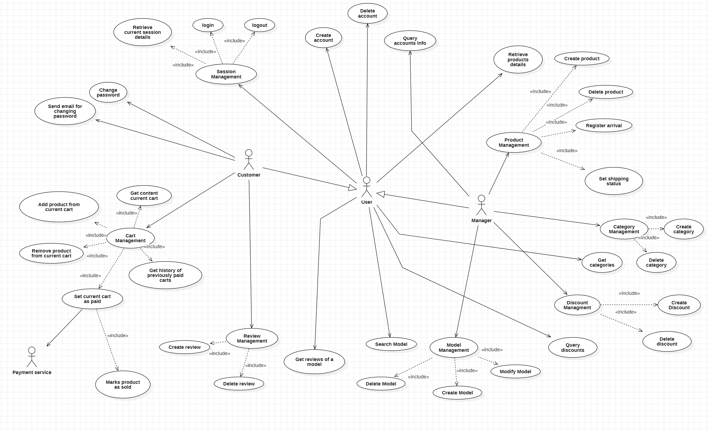

# Requirements Document - future EZElectronics

Date:

Version: V1 - description of EZElectronics in FUTURE form (as proposed by the team)

| Version number | Change |
| :------------: | :----: |
|     1           |        |

# Contents

- [Requirements Document - future EZElectronics](#requirements-document---future-ezelectronics)
- [Contents](#contents)
- [Informal description](#informal-description)
- [Stakeholders](#stakeholders)
- [Context Diagram and interfaces](#context-diagram-and-interfaces)
  - [Context Diagram](#context-diagram)
  - [Interfaces](#interfaces)
- [Stories and personas](#stories-and-personas)
- [Functional and non functional requirements](#functional-and-non-functional-requirements)
  - [Functional Requirements](#functional-requirements)
  - [Non Functional Requirements](#non-functional-requirements)
- [Use case diagram and use cases](#use-case-diagram-and-use-cases)
  - [Use case diagram](#use-case-diagram)
    - [Use case 1, login](#use-case-1-login)
    - [Use case 2, logout](#use-case-2-logout)
    - [Use case 3, Retrieve current session detail](#use-case-3-retrieve-current-session-details)
    - [Use case 4, Create account](#use-case-4-create-account)
    - [Use case 5, Query accounts info](#use-case-5-query-accounts-info)
    - [Use case 6, Delete account](#use-case-6-delete-account)
    - [Use case 7, Retrieve products details](#use-case-7-retrieve-products-details)
    - [Use case 8, Create product](#use-case-8-create-product)
    - [Use case 9, Delete Product](#use-case-9-delete-product)
    - [Use case 10, Register arrival of products](#use-case-10-register-arrival-of-products)
    - [Use case 11, Mark product as sold](#use-case-11-mark-product-as-sold)
    - [Use case 12, Get content of current cart](#use-case-12-get-content-of-current-cart)
    - [Use case 13, Add product to current cart](#use-case-13-add-product-to-current-cart)
    - [Use case 14, Remove product from current cart](#use-case-14-remove-product-from-current-cart)
    - [Use case 15, Set current cart as paid](#use-case-15-set-current-cart-as-paid)
    - [Use case 16, Get history previosly paid carts](#use-case-16-get-history-of-previously-paid-cart)
    - [Use case 17, Get email to change password](#use-case-17-send-email-to-change-password)
    - [Use case 18, Change password](#use-case-18change-password)
    - [Use case 19, Set product shipping status](#use-case-19set-product-shipping-status)
    - [Use case 20, Create category](#use-case-20create-category)
    - [Use case 21, Delete category](#use-case-21delete-category)
    - [Use case 22, Get categories](#use-case-22get-categories)
    - [Use case 23, Create model](#use-case-23create-model)
    - [Use case 24, Delete model](#use-case-24delete-model)
    - [Use case 25, Modify model](#use-case-25modify-model)
    - [Use case 26, Search models](#use-case-26search-models)
    - [Use case 27, Create discount](#use-case-27create-discount)
    - [Use case 28, Delete discount](#use-case-28delete-discount)
    - [Use case 29, Query discount](#use-case-29query-discount)
    - [Use case 30, Create review](#use-case-30create-review)
    - [Use case 31, Delete review](#use-case-31delete-review)
    - [Use case 32, Get reviews of a model](#use-case-32get-reviews-of-a-model)
- [Glossary](#glossary)
- [System Design](#system-design)
- [Deployment Diagram](#deployment-diagram)

# Informal description

EZElectronics (read EaSy Electronics) is a software application designed to help managers of electronics stores to manage their products and offer them to customers through a dedicated website. Managers can assess the available products, record new ones, and confirm purchases. Customers can see available products, add them to a cart and see the history of their past purchases.

# Stakeholders

| Stakeholder name | Description |
| :--------------: | :---------: |
| Stakeholder x..  |             |

# Context Diagram and interfaces

## Context Diagram

\<Define here Context diagram using UML use case diagram>

\<actors are a subset of stakeholders>

## Interfaces

\<describe here each interface in the context diagram>

\<GUIs will be described graphically in a separate document>

|   Actor   | Logical Interface | Physical Interface |
| :-------: | :---------------: | :----------------: |
| Actor x.. |                   |                    |

# Stories and personas

\<A Persona is a realistic impersonation of an actor. Define here a few personas and describe in plain text how a persona interacts with the system>

\<Persona is-an-instance-of actor>

\<stories will be formalized later as scenarios in use cases>

# Functional and non functional requirements

## Functional Requirements

|  ID   | Description |
| :---: | :---------: |
|  FR1  | Authorization and Authentication |
|   FR1.1  | Account Management |
|  FR1.1.1  | Create/Delete Account (Customer/Manager) |
|  FR1.1.2  | Query informations about one or more accounts |
|  FR1.1.3  | Send email for changing password |
|  FR1.1.4  | Change password |
|  FR1.2  | Session Management |
|  FR1.2.1  | Login/Logout |
|  FR1.2.2  | Retrieve current session details |
|  FR2  | Store Management |
|  FR2.1  | Products Management |
|  FR2.1.1  | Create/Delete Product |
|  FR2.1.2  | Update information of a product (Mark as sold, set status) |
|  FR2.1.3  | Register arrival of a set of products of the same model |
|  FR2.1.4  | Query informations about one or more products |
|  FR2.2  | Category Management |
|  FR2.2.1  | Create/Delete Category |
|  FR2.2.1  | Get Categories |
|  FR2.3  | Model Management |
|  FR2.3.1  | Create/Delete Model |
|  FR2.3.2  | Modify Model | 
|  FR2.3.3  | Search Models | 
|  FR2.4  | Discount Management |
|  FR2.4.1  | Create/Delete discount |
|  FR2.4.2  | Query discount |
|  FR3  | Carts management for a logged customer |
|  FR3.1  | Create a cart |
|  FR3.2  | Get content of the current cart |
|  FR3.3  | Add/Remove a product from the current cart |
|  FR3.4  | Set current cart as paid |
|  FR3.5  | Get history of previously paid carts |
|  FR4  | Review Management |
|  FR4.1  | Create/Delete Review |
|  FR4.2  | Get reviews of a model |
|  FR5  | Payment Management |
|  FR5.1  | Require payment informations (ask name, surname, credit card details) |
|  FR5.2  | Manage payment information with payment service (send, ask to check card, ask to debit, ask to credit) |
|  FR6  | Privacy Management |
|  FR6.1  | Show legal constraints |

## Non Functional Requirements

\<Describe constraints on functional requirements>

|   ID    | Type (efficiency, reliability, ..) | Description | Refers to |
| :-----: | :--------------------------------: | :---------: | :-------: |
|  NFR1   |                                    |             |           |
|  NFR2   |                                    |             |           |
|  NFR3   |                                    |             |           |
| NFRx .. |                                    |             |           |

# Use case diagram and use cases

## Use case diagram

### Use case 1, Login<!--- DONE -->

| Actors Involved  | User |
| :--------------: | :------------------------------------------------------------------: |
|   Precondition   | User not logged in, user registered |
|  Post condition  | User logged in |
| Nominal Scenario | 1-1 |
|     Variants     | None |
|    Exceptions    | cenario 1-2, 1-3 |

##### Scenario 1-1

|  Scenario 1-1  | Login |
| :------------: | :------------------------------------------------------------------------: |
|  Precondition  | User not logged in, user registered |
| Post condition | Logged in |
|     Step#      |                                Description                                 |
|       1        | System: Ask username, password |
|       2        | User: Provide username, password |
|       3        | System: Read username, password |
|       4        | System: Retrieve password, compare with the one provided. Passwords match, user is authorised |

##### Scenario 1-2

|  Scenario 1-2  | User not registered |
| :------------: | :------------------------------------------------------------------------: |
|  Precondition  | User not logged in, user not registered |
| Post condition | Not logged in |
|     Step#      |                                Description                                 |
|       1        | System: Ask username, password |
|       2        | User: Provide username, password |
|       3        | System: Read username, password. Check cookie,  the user is not logged in |
|       4        | System: Given username, find the user. User is not found. User not authorised |

##### Scenario 1-3

|  Scenario 1-3  | User already logged in |
| :------------: | :------------------------------------------------------------------------: |
|  Precondition  | User logged in, User registered |
| Post condition | User logged in |
|     Step#      |                                Description                                 |
|       1        | System: Ask username, password |
|       2        | User: Provide username, password |
|       3        | System: Read username, password. Check cookie,  the user is already logged in |
|       4        | System: Return an error message |

### Use case 2, Logout<!--- DONE -->

| Actors Involved  | User |
| :--------------: | :------------------------------------------------------------------: |
|   Precondition   | User logged in |
|  Post condition  | User not logged in |
| Nominal Scenario | 2-1 |
|     Variants     | None |
|    Exceptions    | Scenario 2-2 |

##### Scenario 2-1, Logout

|  Scenario 2-1  | Logout |
| :------------: | :------------------------------------------------------------------------: |
|  Precondition  | User logged in |
| Post condition | User not logged in |
|     Step#      |                                Description                                 |
|       1        | User: Asks to logout |
|       2        | System: Find user, check cookie, the user is logged in |
|       3        | System: Remove authorization to the user device |

##### Scenario 2-2

|  Scenario 2-2  | User already logged out |
| :------------: | :------------------------------------------------------------------------: |
|  Precondition  | User not logged in |
| Post condition | User not logged in |
|     Step#      |                                Description                                 |
|       1        | User: Asks to logout |
|       2        | System: Check that the user isn't already logged out |
|       3        | System: User hasn't performed login yet. Show an error message |

### Use case 3, Retrieve current session details<!--- DONE -->

| Actors Involved  | User |
| :--------------: | :------------------------------------------------------------------: |
|   Precondition   | User logged in |
|  Post condition  | User information shown |
| Nominal Scenario | 3-1 |
|     Variants     | None |
|    Exceptions    | Scenario 3-2 |

##### Scenario 3-1

|  Scenario 3-1  | Retrieve current session details |
| :------------: | :------------------------------------------------------------------------: |
|  Precondition  | User logged in |
| Post condition | User information shown |
|     Step#      |                                Description                                 |
|       1        | User: logged in |
|       2        | System: Show username,name, surname, role of the logged in user |

##### Scenario 3-2

|  Scenario 3-2  | User not logged in |
| :------------: | :------------------------------------------------------------------------: |
|  Precondition  | User not logged in |
| Post condition | Request not fulfilled |
|     Step#      |                                Description                                 |
|       1        | User Go to log in address |
|       2        | System: Check that the user is already logged in |
|       3        | System: User hasn't performed login yet. Show an error message |

### Use case 4, Create Account<!--- DONE -->

| Actors Involved  | User |
| :--------------: | :------------------------------------------------------------------: |
|   Precondition   | The user doesn't have an account |
|  Post condition  | User has an account |
| Nominal Scenario | 4-1 |
|     Variants     | None |
|    Exceptions    | Scenario 4-2 |

##### Scenario 4-1

|  Scenario 4-1  | Create Account |
| :------------: | :------------------------------------------------------------------------: |
|  Precondition  | The user doesn't have an account |
| Post condition | User has an account |
|     Step#      |                                Description                                 |
|       1        | User: Ask to create account |
|       2        | System: Ask username, name, surname, password, role |
|       3        | User: Provide username, name, surname, password, role |
|       4        | System: Read username, name, surname, password,role |
|       5        | System: Check that the provided username isn't associated with any account yet. The username hasn't been used yet |
|       6        | System: Create a new user and store his information |

##### Scenario 4-2

|  Scenario 4-2  | The User already has an account |
| :------------: | :------------------------------------------------------------------------: |
|  Precondition  | The user has an account |
| Post condition | Registration failed |
|     Step#      |                                Description                                 |
|       1        | User: Ask to create account |
|       2        | System: Ask username, name, surname, password,role |
|       3        | User: Provide username, name, surname, password,role |
|       4        | System: Read username, name, surname, password,role |
|       5        | System: Check that the provided username isn't associated with any account yet. The username has been used already, sends error |

### Use case 5, Query Accounts info<!--- DONE -->

| Actors Involved  | User |
| :--------------: | :------------------------------------------------------------------: |
|   Precondition   | User is logged in and has no information about something |
|  Post condition  | User has information about something |
| Nominal Scenario | 5-1 |
|     Variants     | 5-2, 5-3 |
|    Exceptions    | Scenario 5-4, 5-5|

##### Scenario 5-1

|  Scenario 5-1  | Get the list of all users |
| :------------: | :------------------------------------------------------------------------: |
|  Precondition  | User has not the list of all users |
| Post condition | List of all users is shown |
|     Step#      |                                Description                                 |
|       1        | User: Ask all users |
|       2        | System: Return all the users, and show their information |

##### Scenario 5-2

|  Scenario 5-2  | Get the list of all users with a specific role |
| :------------: | :------------------------------------------------------------------------: |
|  Precondition  | User doesn’t have list of all users with a specific role |
| Post condition | List of all users with a specific role is shown |
|     Step#      |                                Description                                 |
|       1        | User: Ask all users specifying the role |
|       2        | System: Return all the users with a specific role, and show their information |

##### Scenario 5-3

|  Scenario 5-3  | Get User with a specific username |
| :------------: | :------------------------------------------------------------------------: |
|  Precondition  | User has no information |
| Post condition | The specific user is shown |
|     Step#      |                                Description                                 |
|       1        | User: ask user info for a certain user. Provide username |
|       2        | System: Check that the provided username exists in the database |
|       3        | System: Retrieve the details about the user that's performing the request |
|       4        | System: Check if the username provided matches with the user's one. They match |
|       5        | System: Show user information |

##### Scenario 5-4

|  Scenario 5-4  | User with a specific username not found |
| :------------: | :------------------------------------------------------------------------: |
|  Precondition  | None |
| Post condition | The specified user not found |
|     Step#      |                                Description                                 |
|       1        | User: ask user info for a certain user. Provide username |
|       2        | System: Check that the provided username exists in the database. They don't match |
|       3        | System: sends error |
##### Scenario 5-5

|  Scenario 5-5  | User not logged in |
| :------------: | :------------------------------------------------------------------------: |
|  Precondition  | None |
| Post condition |  Request not fulfilled|
|     Step#      |                                Description                                 |
|       1        |  User makes the request|
|       2        |  System detects user is not logged in|
|       3        |  System sends error|

### Use case 6, Delete Account<!--- DONE -->

| Actors Involved  |  User|
| :--------------: | :------------------------------------------------------------------: |
|   Precondition   |  User has an account|
|  Post condition  |  The user doesn't have an account|
| Nominal Scenario |  6-1|
|     Variants     |  None|
|    Exceptions    |  Scenario 6-2, 6-3|

##### Scenario 6.1

|  Scenario 6.1  |  Delete user|
| :------------: | :------------------------------------------------------------------------: |
|  Precondition  |  User has an account|
| Post condition |  The user doesn't have an account|
|     Step#      |                                Description                                 |
|       1        |  User: Ask to delete account|
|       2        |  System: Ask username|
|       3        |  User: Provide username|
|       4        |  System: Read username,Check if the provided username exists in the database.|
|       5        |  System: find user, delete user account|

##### Scenario 6.2

|  Scenario 6.2  |  User doesn’t exist |
| :------------: | :------------------------------------------------------------------------: |
|  Precondition  |  The user doesn't have an account|
| Post condition |  Request not fulfilled|
|     Step#      |                                Description                                 |
|       1        |  User: Ask to delete account|
|       2        | System: Ask username|
|       3        |  User: Provide username|
|       4        |  System: Read username,Check if the provided username exists in the database.|
|       5        |  System: user does not exist in the database, Provide error message|

##### Scenario 6.3

|  Scenario 6.3  |  User is not a manager and try to delete someone else account|
| :------------: | :------------------------------------------------------------------------: |
|  Precondition  |  |
| Post condition |  Request not fulfilled|
|     Step#      |                                Description                                 |
|       1        |  User: Ask to delete account|
|       2        | System: Ask username|
|       3        |  User: Provide username|
|       4        |  System: Read username,Check if the provided username exists in the database.|
|       5        |  System: user doesn't have permission to delete account , Provide error message|

### Use case 7, Retrieve products details<!--- DONE -->

| Actors Involved  |  User|
| :--------------: | :------------------------------------------------------------------: |
|   Precondition   |  User logged in|
|  Post condition  |  Returns all products|
| Nominal Scenario |  7-1|
|     Variants     |  None|
|    Exceptions    |  Scenario 7-2|

##### Scenario 7.1

|  Scenario 7.1  |  Retrieve products details|
| :------------: | :------------------------------------------------------------------------: |
|  Precondition  |  User logged in|
| Post condition |  Returns all products|
|     Step#      |                                Description                                 |
|       1        |  Customer makes the request|
|       2        |  System verifies Customer authentication|
|       3        |  System shows all products	|

##### Scenario 7.2

|  Scenario 7.2  |  User not logged in|
| :------------: | :------------------------------------------------------------------------: |
|  Precondition  |  User not logged in|
| Post condition |  Request not fulfilled|
|     Step#      |                                Description                                 |
|       1        |  Customer makes the request|
|       2        |  System detect customer is not logged in|
|       3        |  System sends error|

### Use case 8, Create product<!--- DONE -->

| Actors Involved  |  Manager|
| :--------------: | :------------------------------------------------------------------: |
|   Precondition   |  Manager is logged in, product doesn’t exist|
|  Post condition  |  Product is created|
| Nominal Scenario |  8-1|
|     Variants     |  None|
|    Exceptions    |  Scenario 8-2, 8-3, 8-4|

##### Scenario 8.1

|  Scenario 8.1  |  Create product|
| :------------: | :------------------------------------------------------------------------: |
|  Precondition  |  Manager is logged in, product doesn’t exist|
| Post condition |  product is created|
|     Step#      |                                Description                                 |
|       1        |  Manager: Ask to create product|
|       2        |  System: Ask code,selling price, model, category, details, arrival date|
|       3        |  Manager: Provide code,selling price, model, category, details, arrival date|
|       4        |  System: Read code,selling price, model, category, details, arrival date|
|       5        |  System: Check that the provided code exists in the database. There is no match for code|
|       6        |  System:Create a new product and store its information|

##### Scenario 8.2

|  Scenario 8.2  |  Manager is not logged in|
| :------------: | :------------------------------------------------------------------------: |
|  Precondition  |  Manager is not logged in|
| Post condition |  Request not fulfilled|
|     Step#      |                                Description                                 |
|       1        |  Manager: Ask to create product|
|       2        |  System: detects manager is not logged in|
|       3        |  System: Provide error|

##### Scenario 8.3

|  Scenario 8.3  |  product already exists in the database|
| :------------: | :------------------------------------------------------------------------: |
|  Precondition  |  Manager is logged in, product  exists|
| Post condition |  Request not fulfilled|
|     Step#      |                                Description                                 |
|       1        |  Manager: Ask to create product|
|       2        |  System: Ask code,selling price, model, category, details, arrival date|
|       3        |  Manager: Provide code,selling price, model, category, details, arrival date|
|       4        |  System: Read code,selling price, model, category, details, arrival date. |
|       5        |  System: Check that the provided code exists in the database. There is a match for code.|
|       6        |  System:Provide error message|

##### Scenario 8.4

|  Scenario 8.4  |  arrival date is after the current date|
| :------------: | :------------------------------------------------------------------------: |
|  Precondition  |  Manager is logged in|
| Post condition |  Request not fulfilled|
|     Step#      |                                Description                                 |
|       1        |  Manager: Ask to create product|
|       2        |  System: Ask code,selling price, model, category, details, arrival date|
|       3        |  Manager: Provide code,selling price, model, category, details, arrival date|
|       4        |  System: Read code,selling price, model, category, details, arrival date|
|       5        |  System: check then the arrival date is before the current date|
|       6        |  System: the arrival date is after the current date, provide error message|

### Use case 9, Delete product<!--- DONE -->

| Actors Involved  |  Manager|
| :--------------: | :------------------------------------------------------------------: |
|   Precondition   |  Manager is logged in, product exists|
|  Post condition  |  Product is deleted|
| Nominal Scenario |  9-1|
|     Variants     |  None|
|    Exceptions    |  Scenario 9-2, 9-3|

##### Scenario 9.1

|  Scenario 9.1  |  Delete product|
| :------------: | :------------------------------------------------------------------------: |
|  Precondition  |  Manager is logged in, product exists|
| Post condition |  Product is deleted|
|     Step#      |                                Description                                 |
|       1        |  Manager makes the request sending the id of the product|
|       2        |  System verifies Manager is logged in|
|       3        |  System verifies product exists|
|       4        |  System deletes product|

##### Scenario 9.2

|  Scenario 9.2  |  Manager is not logged in|
| :------------: | :------------------------------------------------------------------------: |
|  Precondition  |  Manager is not logged in|
| Post condition |  Request not fulfilled|
|     Step#      |                                Description                                 |
|       1        |  Manager makes the request sending the id of the product|
|       2        |  Precondition: Manager is not logged in|
|       3        |  System detects manager is not logged in|
|       4        |  System sends error|

##### Scenario 9.3

|  Scenario 9.3  |  The product doesn’t exist|
| :------------: | :------------------------------------------------------------------------: |
|  Precondition  |  Manager is logged in, product doesn’t exist|
| Post condition |  Request not fulfilled|
|     Step#      |                                Description                                 |
|       1        |  Manager make the request sending the id of the product|
|       2        |  System verifies manager is logged in|
|       3        |  System detects product doesn’t exist|
|       4        |  System sends error|

### Use case 10, Register arrival of products<!--- DONE -->

| Actors Involved  |  Manager|
| :--------------: | :------------------------------------------------------------------: |
|   Precondition   |  Manager is logged in, selling date is valid|
|  Post condition  |  The arrival is registered|
| Nominal Scenario |  10-1|
|     Variants     |  None|
|    Exceptions    |  Scenario 10-2, 10-3|

##### Scenario 10.1

|  Scenario 10.1  |  Register arrival of products|
| :------------: | :------------------------------------------------------------------------: |
|  Precondition  |  Manager is logged in, arrival date is valid|
| Post condition |  The arrival is registered|
|     Step#      |                                Description                                 |
|       1        |  Manager makes the request sending the informations of the products and the arrival date|
|       2        |  System verifies Manager is logged in|
|       3        |  System verifies that the arrival date is prior or equal to the current day|
|       4        |  System registers the arrival|

##### Scenario 10.2

|  Scenario 10.2  |  Manager is not logged in|
| :------------: | :------------------------------------------------------------------------: |
|  Precondition  |  Manager is not logged in|
| Post condition |  Request not fulfilled|
|     Step#      |                                Description                                 |
|       1        |  Manager makes the request sending the informations of the products and the arrival date|
|       2        |  System detects manager is not logged in|
|       3        |  System sends error|

##### Scenario 10.3

|  Scenario 10.3  |  Arrival date is not valid|
| :------------: | :------------------------------------------------------------------------: |
|  Precondition  |  Manager is logged in, arrival date is invalid|
| Post condition |  Request not fulfilled|
|     Step#      |                                Description                                 |
|       1        |  Manager makes the request sending the informations of the products and the arrival date|
|       2        |  System verifies Manager is logged in|
|       3        |  System detects that the arrival date is after the current day |
|       4        |  System sends error|

### Use case 11, Mark product as sold<!--- DONE -->

| Actors Involved  |  Manager|
| :--------------: | :------------------------------------------------------------------: |
|   Precondition   |  Manager is logged in, product exists, product has not been sold, selling date is valid|
|  Post condition  |  Product is sold|
| Nominal Scenario |  11-1|
|     Variants     |  None|
|    Exceptions    |  Scenario 11-2, 11-3, 11-4, 11-5|

##### Scenario 11.1

|  Scenario 11.1  |  Mark product as sold|
| :------------: | :------------------------------------------------------------------------: |
|  Precondition  |  Manager is logged in, product exists, product has not been sold, selling date is valid|
| Post condition |  Product is sold|
|     Step#      |                                Description                                 |
|       1        |  Manager makes the request sending the id of the product and the selling date|
|       2        |  System verifies Manager is logged in|
|       3        |  System verifies product exists|
|       4        |  System verifies product has not been sold|
|       5        |  System verifies that the selling date is prior or equal to the current day and after or equal to the arrival date|
|       6        |  System set product as sold|

##### Scenario 11.2

|  Scenario 11.2  |  Manager is not logged in|
| :------------: | :------------------------------------------------------------------------: |
|  Precondition  |  Manager is not logged in|
| Post condition |  Request not fulfilled|
|     Step#      |                                Description                                 |
|       1        |  Manager makes the request sending the id of the product and the selling date|
|       2        |  System detects manager is not logged in|
|       3        |  System sends error|

##### Scenario 11.3

|  Scenario 11.3  |  The product doesn’t exist|
| :------------: | :------------------------------------------------------------------------: |
|  Precondition  |  Manager is logged in, product doesn’t exist|
| Post condition |  Request not fulfilled|
|     Step#      |                                Description                                 |
|       1        |  Manager make the request sending the id of the product and the selling date|
|       2        |  System verifies manager is logged in|
|       3        |  System detects product doesn’t exist|
|       4        |  System sends error|

##### Scenario 11.4

|  Scenario 11.4  |  The product has been sold|
| :------------: | :------------------------------------------------------------------------: |
|  Precondition  |  Manager is logged in, product exists, product has been sold|
| Post condition |  Request not fulfilled|
|     Step#      |                                Description                                 |
|       1        |  Manager makes the request sending the id of the product and the selling date|
|       2        |  System verifies Manager is logged in|
|       3        |  System verifies product exists|
|       4        |  System detects that the product has been sold|
|       5        |  System sends error|

##### Scenario 11.5

|  Scenario 11.5  |  Selling date is not valid|
| :------------: | :------------------------------------------------------------------------: |
|  Precondition  |  Manager is logged in, product exists, product has not been sold, selling date is invalid|
| Post condition |  Request not fulfilled|
|     Step#      |                                Description                                 |
|       1        |  Manager makes the request sending the id of the product and the selling date|
|       2        |  System verifies Manager is logged in|
|       3        |  System verifies product exists|
|       4        |  System verifies product has not been sold|
|       5        |  System detects that the selling date is after the current day or is prior the arrival date|
|       6        |  System sends error|

### Use case 12, Get content of current cart<!--- DONE -->

| Actors Involved  |  Customer|
| :--------------: | :------------------------------------------------------------------: |
|   Precondition   |  Customer is logged in|
|  Post condition  |  Customer get the list of product contained in his current cart|
| Nominal Scenario |  12-1|
|     Variants     |  None|
|    Exceptions    |  Scenario 12-2|

##### Scenario 12.1

|  Scenario 12.1  |  Get content of current cart|
| :------------: | :------------------------------------------------------------------------: |
|  Precondition  |  Customer is logged in|
| Post condition |  Customer get the list of product contained in his current cart|
|     Step#      |                                Description                                 |
|       1        |  Customer makes the request|
|       2        |  System verifies Customer authentication|
|       3        |  System sends the list of product contained in his current cart|

##### Scenario 12.2

|  Scenario 12.2  |  Customer is not logged in|
| :------------: | :------------------------------------------------------------------------: |
|  Precondition  |  Customer is not logged in|
| Post condition |  Request not fulfilled|
|     Step#      |                                Description                                 |
|       1        |  Customer makes the request|
|       2        |  System detect customer is not logged in|
|       3        |  System sends error|

### Use case 13, Add product to current cart<!--- DONE -->

| Actors Involved  |  Customer|
| :--------------: | :------------------------------------------------------------------: |
|   Precondition   |  Customer is logged in, the product exists, the product is not already contained in a cart, the product has not been sold yet|
|  Post condition  |  Product added to current cart|
| Nominal Scenario |  13-1|
|     Variants     |  None|
|    Exceptions    |  Scenario 13-2, 13-3, 13-4, 13-5|

##### Scenario 13.1

|  Scenario 13.1  |  Add product to current cart|
| :------------: | :------------------------------------------------------------------------: |
|  Precondition  |  Customer is logged in, the product exists, the product is not already contained in a cart, the product has not been sold yet|
| Post condition |  Product added to current cart|
|     Step#      |                                Description                                 |
|       1        |  Customer makes the request sending the id of the product|
|       2        |  System verifies Customer is logged in|
|       3        |  System verifies product exists|
|       4        |  System verifies product is not already contained in a cart|
|       5        |  System verifies product has not been sold|
|       6        |  System adds the product to the current cart|
|       7        |  System sends success message|

##### Scenario 13.2

|  Scenario 13.2  |  Customer is not logged in|
| :------------: | :------------------------------------------------------------------------: |
|  Precondition  |  Customer is not logged in|
| Post condition |  Request not fulfilled|
|     Step#      |                                Description                                 |
|       1        |  Customer makes the request sending the id of the product|
|       2        |  System detect customer is not logged in|
|       3        |  System sends error|

##### Scenario 13.3

|  Scenario 13.3  |  The product doesn’t exist|
| :------------: | :------------------------------------------------------------------------: |
|  Precondition  |  Customer is logged in, product doesn’t exist|
| Post condition |  Request not fulfilled|
|     Step#      |                                Description                                 |
|       1        |  Customer make the request sending the id of the product|
|       2        |  System verifies Customer logged in|
|       3        |  System detects product doesn’t exist|
|       4        |  System send error|

##### Scenario 13.4

|  Scenario 13.4  |  The product is already contained in a cart|
| :------------: | :------------------------------------------------------------------------: |
|  Precondition  |  Customer is logged in, product exists, product is already contained in a cart|
| Post condition |  Request not fulfilled|
|     Step#      |                                Description                                 |
|       1        |  Customer make the request sending the id of the product|
|       2        |  System verifies Customer logged in|
|       3        |  System verifies product exists|
|       4        |  System detects product in another cart|
|       5        |  System sends error|

##### Scenario 13.5

|  Scenario 13.5  |  The product has been sold|
| :------------: | :------------------------------------------------------------------------: |
|  Precondition  |  Customer is logged in, product exists, product has been sold|
| Post condition |  Request not fulfilled|
|     Step#      |                                Description                                 |
|       1        |  Customer make the request sending the id of the product|
|       2        |  System verifies Customer is logged in|
|       3        |  System verifies product exists|
|       4        |  System verifies product is not not already contained in a cart|
|       5        |  System detect that product has been sold|
|       6        |  System sends error|

### Use case 14, Remove product from current cart<!--- DONE -->

| Actors Involved  |  Customer|
| :--------------: | :------------------------------------------------------------------: |
|   Precondition   |  Customer is logged in, the product is contained in the current cart|
|  Post condition  |  Product i removed from current cart|
| Nominal Scenario |  14-1|
|     Variants     |  None|
|    Exceptions    |  Scenario 14-2, 14-3|

##### Scenario 14.1

|  Scenario 14.1  |  Remove product from current cart|
| :------------: | :------------------------------------------------------------------------: |
|  Precondition  |  Customer is logged in, the product is contained in the current cart|
| Post condition |  Product removed from current cart|
|     Step#      |                                Description                                 |
|       1        |  Customer make the request sending the id of the product|
|       2        |  System verifies Customer is logged in|
|       3        |  System verifies product is in the cart|
|       4        |  Systems remove the product from the current cart|
|       5        |  System send success message|

##### Scenario 14.2

|  Scenario 14.2  |  Customer is not logged in|
| :------------: | :------------------------------------------------------------------------: |
|  Precondition  |  Customer is not logged in|
| Post condition |  Request not fulfilled|
|     Step#      |                                Description                                 |
|       1        |  Customer make the request|
|       2        |  System detects Customer is not logged in|
|       3        |  Systems send error|

##### Scenario 14.3

|  Scenario 14.3  |  The product is not contained in the current cart|
| :------------: | :------------------------------------------------------------------------: |
|  Precondition  |  Customer is logged in, product is not contained in the current cart|
| Post condition |  Request not fulfilled|
|     Step#      |                                Description                                 |
|       1        |  Customer make the request|
|       2        |  System verifies Customer is logged in|
|       3        |  System detects cart is not empty|
|       4        |  System sends error|

### Use case 15, Set current cart as paid<!--- DONE -->

| Actors Involved  |  Customer|
| :--------------: | :------------------------------------------------------------------: |
|   Precondition   |  Customer is logged in, current cart is not empty|
|  Post condition  |  Customer’s current cart is paid|
| Nominal Scenario |  15-1|
|     Variants     |  None|
|    Exceptions    |  Scenario 15-2, 15-3|

##### Scenario 15.1

|  Scenario 15.1  |  Set current cart as paid|
| :------------: | :------------------------------------------------------------------------: |
|  Precondition  |  Customer is logged in, current cart is not empty|
| Post condition |  Customer’s current cart is paid|
|     Step#      |                                Description                                 |
|       1        |  Customer makes the request|
|       2        |  System verifies Customer is logged in|
|       3        |  System verifies cart is empty|
|       4        |  System sets customer’s current cart as paid|

##### Scenario 15.2

|  Scenario 15.2  |  Customer is not logged in|
| :------------: | :------------------------------------------------------------------------: |
|  Precondition  |  Customer is not logged in|
| Post condition |  Customer’s current cart is not paid|
|     Step#      |                                Description                                 |
|       1        |  Customer makes the request|
|       2        |  System detects Customer is not logged in|
|       3        |  System sends error|

##### Scenario 15.3

|  Scenario 15.3  |  Current cart is empty|
| :------------: | :------------------------------------------------------------------------: |
|  Precondition  |  Customer is logged in, current cart is empty|
| Post condition |  Request not fulfilled|
|     Step#      |                                Description                                 |
|       1        |  Customer makes the request|
|       2        |  System verifies Customer is logged in|
|       3        |  System detects car as not empty|
|       4        |  System sends error|

### Use case 16, Get history of previously paid cart <!--- DONE -->

| Actors Involved  | Customer |
| :--------------: | :------------------------------------------------------------------: |
|   Precondition   |  Customer is logged in|
|  Post condition  |  Customer get the list of previously paid carts|
| Nominal Scenario |  16-1|
|     Variants     |  None|
|    Exceptions    |  Scenario 16-2|

##### Scenario 16.1

|  Scenario 16.1  | Get history of previously paid cart |
| :------------: | :------------------------------------------------------------------------: |
|  Precondition  |  Customer is logged in|
| Post condition | Customer get the list of previously paid carts |
|     Step#      |                                Description                                 |
|       1        |  Customer makes the request|
|       2        |  System verifies Customer logged in|
|       3        |  System return previously paid carts content|

##### Scenario 16.2

|  Scenario 16.2  |  Customer is not logged in|
| :------------: | :------------------------------------------------------------------------: |
|  Precondition  |  Customer is not logged in|
| Post condition |  Request not fulfilled|
|     Step#      |                                Description                                 |
|       1        | Customer makes the request|
|       2        | System detects customer is not logged in |
|       3        | System sends error |

### Use case 17, Send email to change password 

| Actors Involved  |  Customer|
| :--------------: | :------------------------------------------------------------------: |
|   Precondition   |  Customer has an account and is not logged in|
|  Post condition  |  Email is sent to customer|
| Nominal Scenario |  17-1|
|     Variants     |  None|
|    Exceptions    |  Scenario|

### Use case 18,Change password 

| Actors Involved  |  Customer|
| :--------------: | :------------------------------------------------------------------: |
|   Precondition   |  Customer has valid pin os is logged in|
|  Post condition  |  Password is changed|
| Nominal Scenario |  18-1|
|     Variants     |  None|
|    Exceptions    |  Scenario|

### Use case 19,set product shipping status

| Actors Involved  |  Manager|
| :--------------: | :------------------------------------------------------------------: |
|   Precondition   |  Manager is logged in, product exist, status is valid|
|  Post condition  |  Status is changed|
| Nominal Scenario |  19-1|
|     Variants     |  None|
|    Exceptions    |  Scenario|

### Use case 20,Create Category <!--- DONE -->

| Actors Involved  |  Manager|
| :--------------: | :------------------------------------------------------------------: |
|   Precondition   |  Manager is logged in|
|  Post condition  |  Category is created|
| Nominal Scenario |  20-1|
|     Variants     |  None|
|    Exceptions    |  Scenario 20-2|

##### Scenario 20.1

|  Scenario 20.1  |  Create Category|
| :------------: | :------------------------------------------------------------------------: |
|   Precondition   |  Manager is logged in|
|  Post condition  |  Category is created|
|     Step#      |                                Description                                 |
|       1        |  Manager makes the request sending the informations of the category|
|       2        |  System verifies Manager is logged in|
|       3        |  System creates category the arrival|

##### Scenario 20.2

|  Scenario 20.2  |  Manager is not logged in|
| :------------: | :------------------------------------------------------------------------: |
|  Precondition  |  Manager is not logged in|
| Post condition |  Request not fulfilled|
|     Step#      |                                Description                                 |
|       1        |  Manager makes the request sending the informations of the category|
|       2        |  System detects manager is not logged in|
|       3        |  System sends error|

### Use case 21,Delete Category <!--- DONE -->

| Actors Involved  |  Manager|
| :--------------: | :------------------------------------------------------------------: |
|   Precondition   |  Manager is logged in, category exists|
|  Post condition  |  Category is deleted|
| Nominal Scenario |  21-1|
|     Variants     |  None|
|    Exceptions    |  Scenario 21-2, 21-3|

##### Scenario 21.1

|  Scenario 21.1  |  Delete Category|
| :------------: | :------------------------------------------------------------------------: |
|   Precondition   |  Manager is logged in, category exists|
|  Post condition  |  Category is deleted|
|     Step#      |                                Description                                 |
|       1        |  Manager makes the request sending the name of the category|
|       2        |  System verifies Manager is logged in|
|       3        |  System verifies category exists|
|       4        |  System deletes category|

##### Scenario 21.2

|  Scenario 21.2  |  Manager is not logged in|
| :------------: | :------------------------------------------------------------------------: |
|  Precondition  |  Manager is not logged in|
| Post condition |  Request not fulfilled|
|     Step#      |                                Description                                 |
|       1        |  Manager makes the request sending the name of the category|
|       2        |  Precondition: Manager is not logged in|
|       3        |  System detects manager is not logged in|
|       4        |  System sends error|

##### Scenario 21.3

|  Scenario 21.3  |  The product doesn’t exist|
| :------------: | :------------------------------------------------------------------------: |
|  Precondition  |  Manager is logged in, category doesn’t exist|
| Post condition |  Request not fulfilled|
|     Step#      |                                Description                                 |
|       1        |  Manager makes the request sending the name of the category|
|       2        |  System verifies manager is logged in|
|       3        |  System detects category doesn’t exist|
|       4        |  System sends error|

### Use case 22,Get Categories <!--- DONE -->

| Actors Involved  |  User|
| :--------------: | :------------------------------------------------------------------: |
|   Precondition   |  User want to get all categories|
|  Post condition  |  User get all categories|
| Nominal Scenario |  22-1|
|     Variants     |  None|
|    Exceptions    |  None|

##### Scenario 22.1

|  Scenario 22.1  |  Retrieve products details|
| :------------: | :------------------------------------------------------------------------: |
|   Precondition   |  User want to get all categories|
|  Post condition  |  User get all categories|
|     Step#      |                                Description                                 |
|       1        |  User makes the request|
|       2        |  System shows all products	|

### Use case 23,Create Model

| Actors Involved  |  Manager|
| :--------------: | :------------------------------------------------------------------: |
|   Precondition   |  Manager is logged in|
|  Post condition  |  Model is created|
| Nominal Scenario |  23-1|
|     Variants     |  None|
|    Exceptions    |  Scenario|

### Use case 24,Delete Model

| Actors Involved  |  Manager|
| :--------------: | :------------------------------------------------------------------: |
|   Precondition   |  Manager is logged in, model exist|
|  Post condition  |  Model is deleted|
| Nominal Scenario |  24-1|
|     Variants     |  None|
|    Exceptions    |  Scenario|

### Use case 25,Modify Model

| Actors Involved  |  Menager|
| :--------------: | :------------------------------------------------------------------: |
|   Precondition   |  Manager is logged in|
|  Post condition  |  Model is modified|
| Nominal Scenario |  25-1|
|     Variants     |  None|
|    Exceptions    |  Scenario|

### Use case 26,Search Models

| Actors Involved  |  User|
| :--------------: | :------------------------------------------------------------------: |
|   Precondition   |  The user want to retrieve a list of model given a search string|
|  Post condition  |  User gets a list of models|
| Nominal Scenario |  26-1|
|     Variants     |  None|
|    Exceptions    |  Scenario|

### Use case 27,Create discount 

| Actors Involved  |  Manager|
| :--------------: | :------------------------------------------------------------------: |
|   Precondition   |  Manager is logged in|
|  Post condition  |  Discount is created, start date and end date are valid|
| Nominal Scenario |  27-1|
|     Variants     |  None|
|    Exceptions    |  Scenario|

### Use case 28,Delete discount 

| Actors Involved  |  Manager|
| :--------------: | :------------------------------------------------------------------: |
|   Precondition   |  Manager is logged in, discount exists|
|  Post condition  |  Discount is deleted|
| Nominal Scenario |  28-1|
|     Variants     |  None|
|    Exceptions    |  Scenario|

### Use case 29,Query discount 

| Actors Involved  |  User|
| :--------------: | :------------------------------------------------------------------: |
|   Precondition   |  User wants a list of discounts|
|  Post condition  |  User receive a list of discounts|
| Nominal Scenario |  29-1|
|     Variants     |  None|
|    Exceptions    |  Scenario|

### Use case 30,Create Review 

| Actors Involved  |  Customer|
| :--------------: | :------------------------------------------------------------------: |
|   Precondition   |  Custoemer is logged in|
|  Post condition  |  Review is created|
| Nominal Scenario |  30-1|
|     Variants     |  None|
|    Exceptions    |  Scenario|

### Use case 31,Delete Review 

| Actors Involved  |  Customer|
| :--------------: | :------------------------------------------------------------------: |
|   Precondition   |  Customer is logged in, custumer own the review|
|  Post condition  |  Review is deleted|
| Nominal Scenario |  31-1|
|     Variants     |  None|
|    Exceptions    |  Scenario|

### Use case 32,Get reviews of a model 

| Actors Involved  |  User|
| :--------------: | :------------------------------------------------------------------: |
|   Precondition   |  User wants a list of the reviws of a model|
|  Post condition  |  User gets a list of reviews|
| Nominal Scenario |  32-1|
|     Variants     |  None|
|    Exceptions    |  Scenario|

# Glossary

\<use UML class diagram to define important terms, or concepts in the domain of the application, and their relationships>

\<concepts must be used consistently all over the document, ex in use cases, requirements etc>

# Deployment Diagram

\<describe here deployment diagram >
